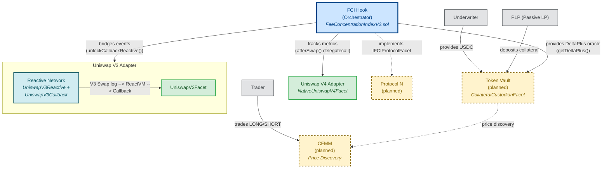
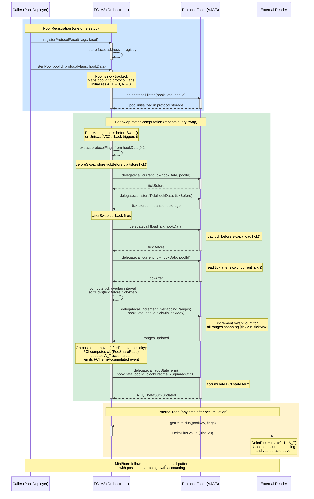

<p align="center">
  <picture>
    <source media="(prefers-color-scheme: dark)" srcset="assets/logo/thetaswap-hero-dark.svg" />
    <source media="(prefers-color-scheme: light)" srcset="assets/logo/thetaswap-hero-mono.svg" />
    
  </picture>
</p>

<h2 align="center">thetaswap</h2>

<p align="center">
  Fee concentration insurance for Uniswap V4 passive LPs
</p>

<p align="center">
  <a href="#architecture">Architecture</a> · <a href="#quick-start--demo">Demo</a> · <a href="#repository-structure">Directory</a>
</p>

---

## Overview

When multiple liquidity providers supply capital to a DEX pool, each should earn a fee share proportional to their contributed liquidity. In practice, a small number of sophisticated actors -- JIT providers and MEV-aware strategies -- concentrate fee revenue away from passive participants, diluting their effective fee rate without generating proportional volume. This is **adverse competition**, a risk dimension orthogonal to both impermanent loss and loss-versus-rebalancing (LVR). ThetaSwap builds the first on-chain adverse competition oracle: the Fee Concentration Index (FCI) Hook tracks fee share distribution across protocols (Uniswap V3 via Reactive Network, V4 natively) and derives a `DeltaPlus` value that prices the insurance-relevant deviation from the competitive equilibrium baseline. See [research/README.md](research/README.md) for the full empirical evidence.

## Architecture

FCI Hook is a protocol-agnostic orchestrator that dispatches behavioral calls via `delegatecall` to registered protocol facets.

### System Context

Solid border = live on testnet. Dashed border = planned.



### Pool Listening Flow

Mint and burn follow the same delegatecall dispatch pattern.



## Quick Start / Demo

```bash
forge test --match-path "test/fee-concentration-index-v2/protocols/uniswapV4/NativeV4FeeConcentrationIndex.integration.t.sol" -vv
```

What the integration test demonstrates:

- **Swap scenario:** each swap updates the A_T accumulator by computing fee share ratios across overlapping positions
- **Mint scenario:** adding liquidity increments position count N and registers the position for FCI tracking
- **Burn scenario:** removing liquidity triggers fee share computation (xk), accumulates the FCI state term, and derives DeltaPlus
- **DeltaPlus query:** external readers call `getDeltaPlus()` to get the insurance-relevant oracle value (`max(0, 1 - A_T)`)
- **Cross-protocol:** the same orchestrator logic works for both V4 native hooks and V3 via Reactive Network callbacks

## Repository Structure

| Directory | Description |
|-----------|-------------|
| `src/` | Solidity contracts: FCI V2 orchestrator, protocol facets (V4 native, V3 reactive), vault, libraries |
| `test/` | Forge test suites: unit, fuzz, fork, and integration tests |
| `research/` | Econometric analysis, backtest engine, mathematical model, data fixtures ([detailed README](research/README.md)) |
| `docs/` | Architecture diagrams (mermaid), implementation plans |
| `specs/` | Contract specifications (per-feature) |
