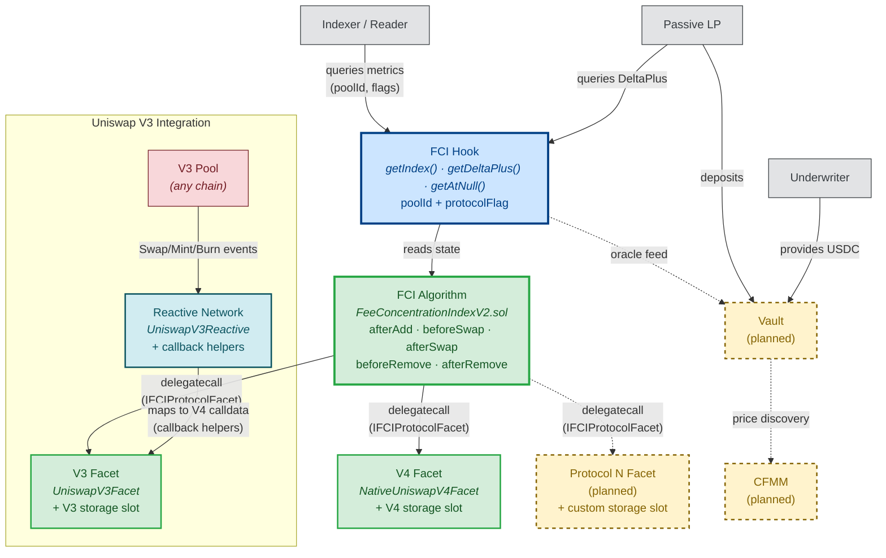

# FCI System Context Diagram

The Fee Concentration Index system has three layers:

1. **FCI Algorithm** (`FeeConcentrationIndexV2.sol`) — warehouses the index logic. Computes fee shares, theta weights, and accumulates A_T. Protocol-agnostic.
2. **Protocol Facets** — route to protocol-specific storage slots and adapt protocol data to the algorithm's interface via helper libraries. Called via `delegatecall` from the algorithm.
3. **FCI Hook** — the client-facing interface. Exposes all metrics (A_T, DeltaPlus, ThetaSum, N) that indexers, LPs, or downstream contracts need. Clients pass `poolId` + `protocolFlag`.

Any protocol can integrate by building: (a) a facet implementing `IFCIProtocolFacet`, (b) callback helper libraries mapping their event data to V4 hook calldata equivalent. The Reactive Network enables connecting pools **on demand** — not limited to pools that instantiated with IHooks from the start. See `protocols/uniswap-v3/` for the reference implementation.

**Legend:** Solid border = live on testnet. Dashed border = planned / not yet deployed.

