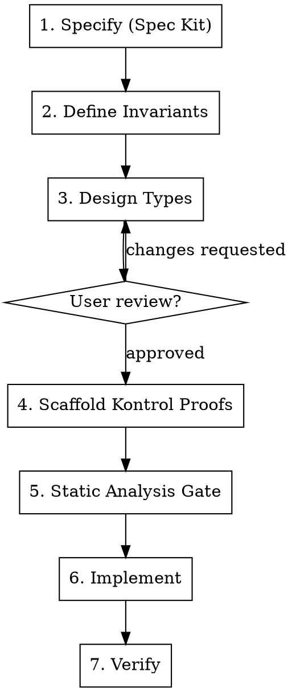

# Type-Driven Development

## Overview

**Define types and invariants BEFORE writing any implementation.** Types encode domain rules at compile time; invariants verify them at runtime and formally. If the types are right, the code writes itself. If the invariants pass, the code is correct.

This skill combines: Idris-style type-driven design (make invalid states unrepresentable), Trail of Bits invariant-driven development (Hoare triples before code), Angstrom-style Solidity UDVTs, Compose/SCOP philosophy (no inheritance, no `library` keyword), Kontrol formal verification, and Spec Kit spec-driven workflow.

## The Iron Law

```
NO IMPLEMENTATION CODE WITHOUT TYPES AND INVARIANTS FIRST
```

Wrote a function body before defining its types? Delete it. Start over.
Wrote business logic before the invariant scaffold? Delete it. Start over.

**No exceptions:**
- Not for "simple types"
- Not for "obvious implementations"
- Not for "urgent deadlines"
- Not for "I'll add invariants after"
- Delete means delete

**Violating the letter of the rules is violating the spirit of the rules.**

## Process



### Phase 1 — Specify (Spec Kit required)

Run `/speckit.specify` to capture WHAT and WHY. Then `/speckit.clarify`, `/speckit.plan`, `/speckit.tasks`. Output: `specs/<feature>/spec.md`, `plan.md`, `tasks.md`.

Spec Kit is not optional. Do not skip this phase.

### Phase 2 — Define Invariants

Write ~10 system invariants BEFORE any Solidity code. Output: `specs/<feature>/invariants.md`.

Each invariant uses this format:

```
| ID          | INV-001                                              |
| Description | Total supply equals sum of all balances               |
| Category    | System-level                                         |
| Hoare Triple| {totalSupply == sum(balances)} -> transfer(a,b,n) -> {totalSupply == sum(balances)} |
| Affected    | TokenFacet, TransferMod                              |
| Verification| Kontrol proof + fuzz test                            |
```

Categories:
- **Function-level**: pure/view computations
- **System-level**: state transitions
- **Type-level**: enforced by construction (validated factories, dimensional types)

Rule of ~10: fewer than 5 means insufficient analysis. More than 20 means mixing invariants with test cases.

### Phase 3 — Design Types

Define UDVTs, structs, enums in `src/types/`. Write companion Mod files (file-level free functions) with `using ... for ... global`. Types must compile. No business logic yet.

**SCOP constraints — no exceptions:**
- No `is` (inheritance) in contracts. Tests and scripts are the only exception.
- No `library` keyword. Use file-level free functions in Mod files.
- No `modifier` keyword. Use inline `if`/`revert` checks or `requireX()` free functions.
- No ternary operator. Use `if`/`else`.
- No `public` functions in contracts. Only `external` and `internal`.

**Type patterns (from Angstrom):**

1. **Dimensional types** — distinct UDVTs for quantities that must not be mixed. `AmountA + AmountB` must not compile. Conversion only through explicit price functions.
2. **Opaque construction** — validated factory is the only way to create a value. No public `wrap()`. If you hold the type, it's valid.
3. **Bit-packed layouts** — single `uint256` UDVT with documented bit positions. All access through typed getters/setters with assembly.
4. **Typed zero as sentinel** — zero value encodes absence. No separate boolean flag.
5. **Variant maps** — `uint8` UDVT where each bit is a named boolean flag with named accessor predicates.

**The Idris principle:** Make invalid states unrepresentable. If two values shouldn't be added, make them different types. If a field has a range constraint, enforce it in the only factory function.

### Phase 4 — Scaffold Kontrol Proofs

Write Kontrol proofs ONE AT A TIME. Each proof is a Foundry test with `prove_` prefix.

```
Write ONE proof -> kontrol build -> kontrol prove --match-test <that proof> ->
verify pass or fix -> ask user to review -> THEN write next proof
```

**Never batch proofs.** Never write multiple proofs before verifying the first one.

Naming convention: `prove_` for Kontrol, `test_` for unit tests, `testFuzz_` for fuzz tests.

Proof scaffold example:

```solidity
import {KontrolCheats} from "kontrol-cheatcodes/KontrolCheats.sol";

contract FeatureProof is Test, KontrolCheats {
    function prove_factory_roundtrips(uint160 raw) public pure {
        vm.assume(raw >= MIN && raw <= MAX);
        SqrtPriceX96 p = SqrtPriceX96Mod.fromUint160(raw);
        assert(SqrtPriceX96.unwrap(p) == raw);
    }
}
```

Tests and scripts MAY use inheritance (`is Test, KontrolCheats`). This is the only exception to the no-inheritance rule.

### Phase 5 — Static Analysis Gate

Before implementation, after types + proof scaffold exist:

```bash
slither src/ --filter-paths "test/"
semgrep --config https://github.com/Decurity/semgrep-smart-contracts --metrics=off src/
```

Fix ALL findings on the type scaffold before writing any implementation logic.

After implementation, run both again on the full codebase.

### Phase 6 — Implement

Write logic inside the typed scaffold. SCOP style: file-level free functions for helpers, explicit `enter()`/`exit()` for reentrancy, inline auth checks.

Types constrain what you can write. If something doesn't typecheck, the design is wrong — go back to Phase 3. Do not force the code to fit.

### Phase 7 — Verify

- `kontrol prove` — all formal proofs pass
- `forge test` — all fuzz tests pass
- Slither + Semgrep — clean
- Every invariant from Phase 2 covered by at least one proof or fuzz test

## Review Gates

### Per-File Review

After EVERY file is created or modified:

1. STOP
2. Ask: "Do you want to review `<filename>` before I continue?"
3. If yes, WAIT for user comments/pseudocode
4. Address ALL comments before touching any other file
5. Ask user to re-review
6. Repeat until approved
7. THEN move to next file

**No batching. No "I'll fix those later." Every comment resolved before moving forward.**

### Proof Review

Each Kontrol proof gets its own review cycle. Write one, build, prove, show result to user, get approval, then write the next.

## Red Flags — STOP and Start Over

- Implementation code before types exist
- Business logic in a type file before invariants are written
- Multiple Kontrol proofs written at once
- `library` keyword anywhere except tests/scripts
- Contract inheritance (`is`) anywhere except tests/scripts
- Skipped static analysis gate
- File modified without asking user to review
- "This is too simple for the full process"
- "I'll add invariants after the implementation works"
- "The types are obvious, I don't need to design them separately"
- "Let me just write a quick prototype first"
- "Time pressure means we skip formal verification"

**All of these mean: STOP. Delete code. Start over from the correct phase.**

| Rationalization | Reality |
|---|---|
| "Too simple to need invariants" | Simple code has subtle invariants. The simpler the type, the faster the invariant phase goes. |
| "I'll add proofs after" | Proofs-after verify what you built. Proofs-before verify what you designed. Different things. |
| "Spec Kit is overkill for a type" | Types are the foundation. Specifying them prevents building the wrong abstraction. |
| "One big proof file is fine" | Batched proofs hide which invariant failed. One at a time gives precise feedback. |
| "The user doesn't need to review every file" | The user catches design mistakes you cannot see. Every file. No exceptions. |
| "Static analysis on a scaffold finds nothing" | It catches type-level issues, import problems, and SCOP violations before they compound. |
| "Urgency justifies shortcuts" | Urgency is exactly when shortcuts cause the worst bugs. The process is fastest when followed. |

## Quick Reference

| Phase | Output | Gate |
|---|---|---|
| Specify | `specs/<feature>/spec.md` | Spec Kit commands complete |
| Invariants | `specs/<feature>/invariants.md` | ~10 invariants in Hoare triple format |
| Types | `src/types/*.sol`, `src/*Mod.sol` | Compiles, no business logic, user reviewed |
| Proofs | `test/kontrol/*.k.sol` | One at a time, each passes `kontrol prove`, user reviewed |
| Static Analysis | Clean Slither + Semgrep | Zero findings on scaffold |
| Implement | `src/*.sol` | Each file user reviewed |
| Verify | All proofs + fuzz + static analysis pass | Full coverage of invariants |

## References

- Edwin Brady, *Type-Driven Development with Idris* — core philosophy
- SorellaLabs/angstrom — Solidity UDVT patterns
- Perfect-Abstractions/Compose — SCOP philosophy, no inheritance
- Trail of Bits, "The Call for Invariant-Driven Development" — invariants before code
- Trail of Bits static-analysis skills — Slither + Semgrep workflow
- Runtime Verification / Kontrol — formal verification via symbolic execution of Foundry tests
- GitHub/spec-kit — spec-driven development workflow
